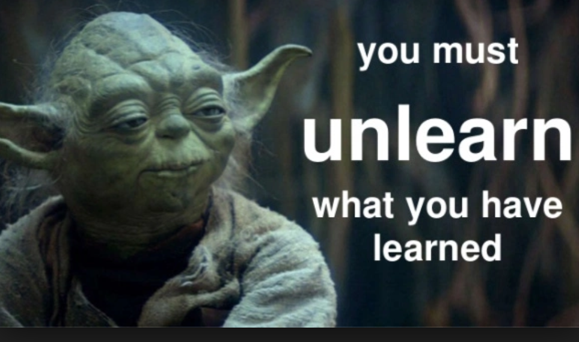

Learning is an every day activity. Fact.

"Unlearn what you have learned" and try things from a different context or perspective.

# Resources

I also like to collect things, here are some references I use to rethink my learning approach.

- [This is exactly how you should train yourself to be smarter [Infographic] - Michael Simmons](https://medium.com/accelerated-intelligence/this-is-exactly-how-you-should-train-yourself-to-be-smarter-infographic-86d0d42ad41c)

Okay, so it's only one link, but there is a lot of content in this article which I'm still diving into. I was thinking I could add some more stuff to this list later, but we will see what draws my attention in the near future.
